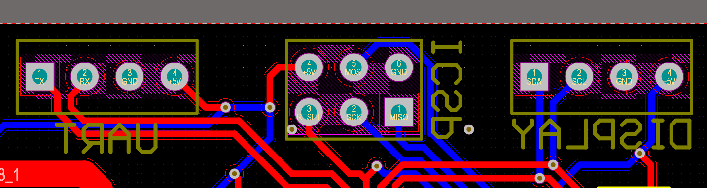

# Battery Module

## Overview
This PCB was created as an upgraded version of battery module. It has 3 Phoenix and 1 XT60 connectors to sum 3 seperate baterry packets up into one source of energy. In addition, it has an Arduino Uno microcontroller ATMEGA328P-AU and Analog to Digital Converter ADS1110A0IDBVT to compute a percenatge of remaining energy in the batteries.

## Schematic

## PCB Layout

## 3D View

## Pinout
### ICSP
| Pin 1 | Pin 2 | Pin 3 | Pin 4 | Pin 5 | Pin 6 |
|-------|-------|-------|-------|-------|-------|
| MISO  | SCK   | RESET | +5V   | MOSI  | GND   |
### UART
| Pin 1 | Pin 2 | Pin 3 | Pin 4 |
|-------|-------|-------|-------|
| TX    | RX    | GND   | +5V   |
### Display
| Pin 1 | Pin 2 | Pin 3 | Pin 4 |
|-------|-------|-------|-------|
| SDA   | SCL   | GND   | +5V   |

## Code

## Notes
## Credits
