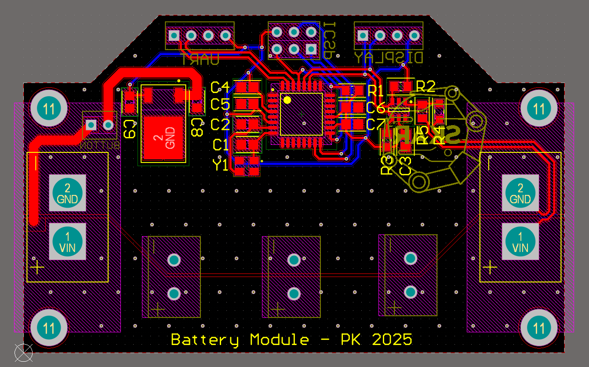
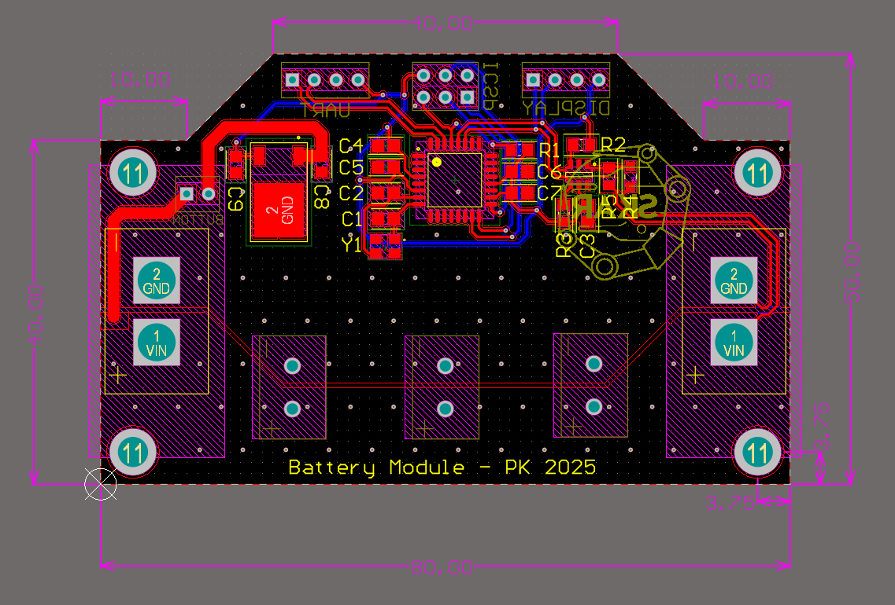
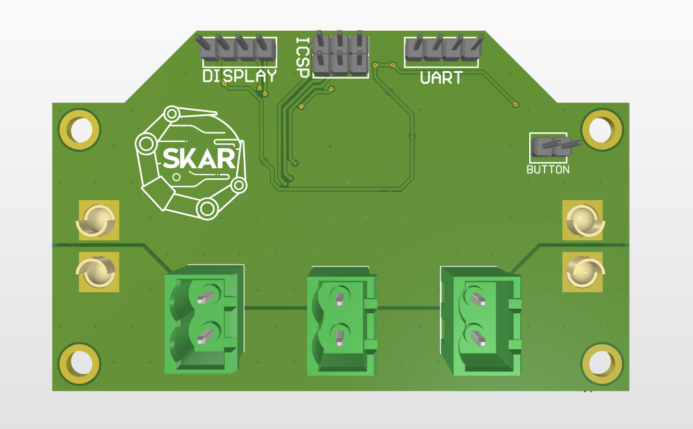
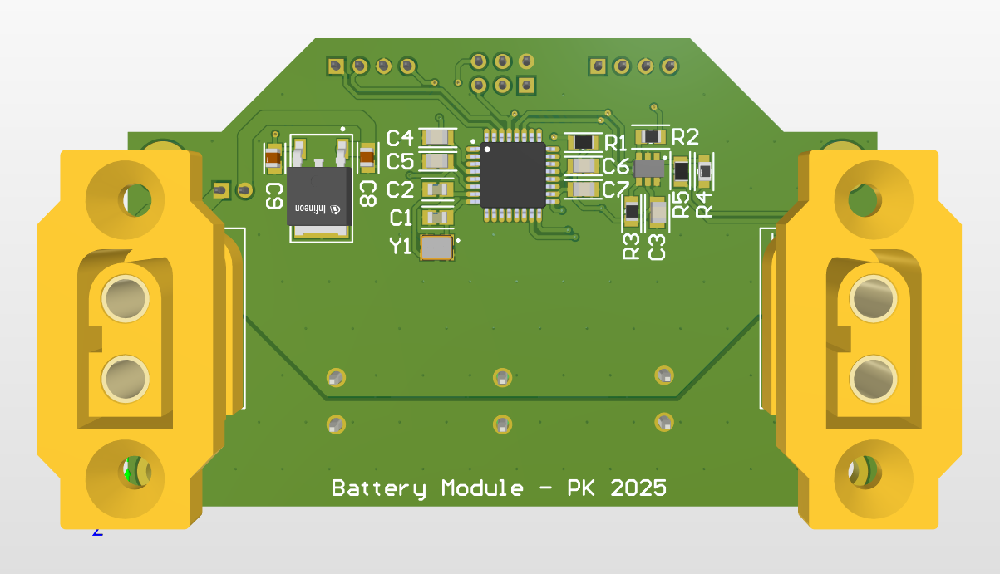
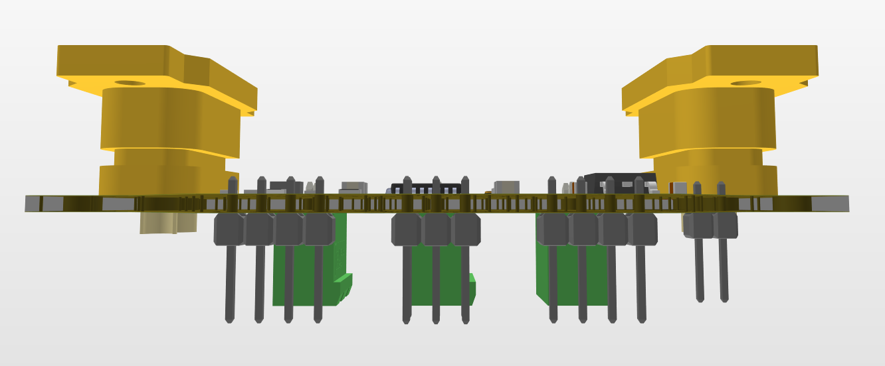
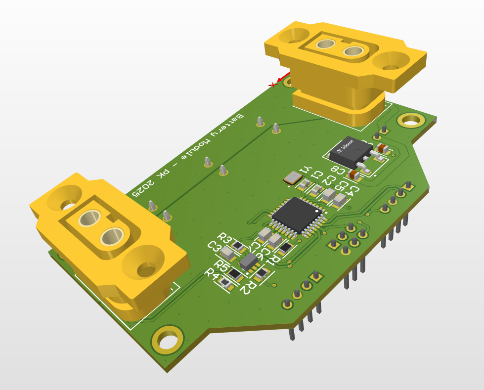
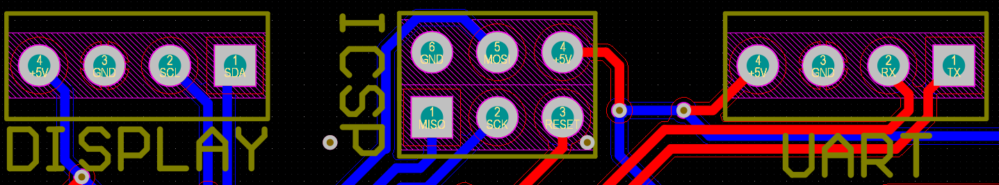

# Battery Module

## Overview
This PCB was created as an upgraded version of the battery module. It has 3 Phoenix and 1 XT60 connectors to combine power from up to 3 separate battery packs into a single power source. There are 2 available places for the XT60 connector.

In addition, the board includes an ATMEGA328P-AU microcontroller (Arduino Uno compatible) and an ADS1110A0IDBVT Analog-to-Digital Converter. These components work together to calculate the remaining battery charge, which can be displayed via an I²C-compatible display.

## Schematic
The board schematic in pdf is [here](schematic.pdf).
## PCB Layout

## PCB Dimensions

## 3D View

## Pinout (view from logo side)
### ICSP
| GND   | MOSI  | +5V   |
|-------|-------|-------|
| MISO  | SCK   | RESET |

### UART
| +5V   | GND   | RX    | TX    | 
|-------|-------|-------|-------|

### Display
| +5V   | GND   | SCL   | SDA   |
|-------|-------|-------|-------|

## Code

## Notes
> [!NOTE]
> Useful information that users should know, even when skimming content.

> [!TIP]
> Helpful advice for doing things better or more easily.

> [!IMPORTANT]
> Key information users need to know to achieve their goal.

> [!WARNING]
> Urgent info that needs immediate user attention to avoid problems.

> [!CAUTION]
> Advises about risks or negative outcomes of certain actions.

## Credits
- Designed by Piotr Kozłowski
- Substantive support by Michał Gołąb
- Graphics by Tomasz Żebrowski
