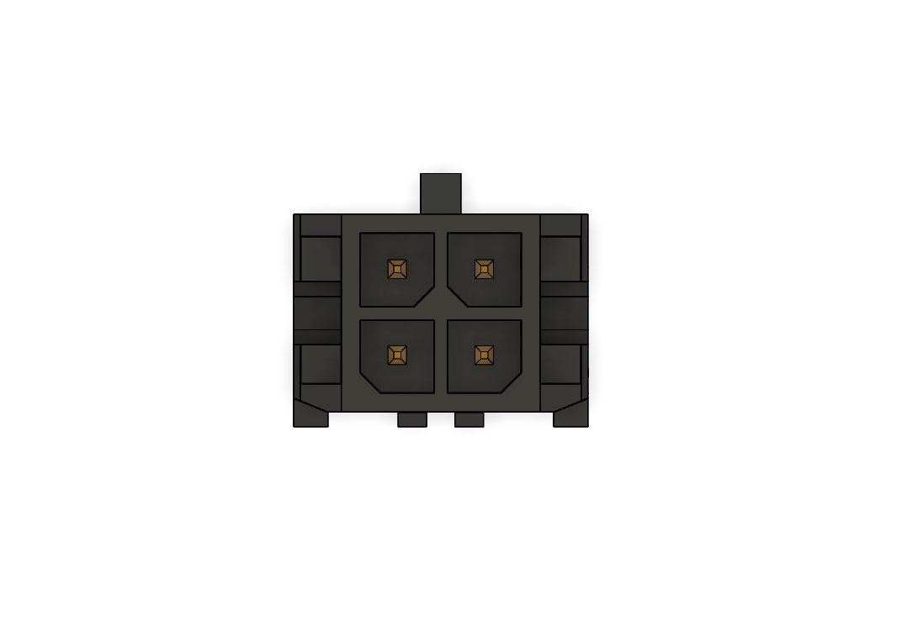

# CANduino
## Description
CANduino is a Arduino Micro-like board capable of communicating via the CAN 2.0 bus. It is based on ATmega32u4 microcontroller.

[ATmega32u4-documentation](https://ww1.microchip.com/downloads/en/devicedoc/atmel-7766-8-bit-avr-atmega16u4-32u4_datasheet.pdf)

## Schematic
The full schematic is available at [Images/schematic.pdf](Images/schematic.pdf)

## Pcb layout
Board dimensions: 43mm x 30.5mm  
Height: 0.63mm (board) + 10.29mm (Micro-Fit) = 10,92mm (total)

### 3D view

## Power supply
Board works on 5V.
Can be powered by USB-C port or CAN bus (better not in the same time)

## CAN bus
CANduino is using MCP2515 controller with MCP2544FD transceiver during CAN communication. MCP2515 implements the CAN specification, Version 2.0B.

CAN controller bitrate: 1 Mb/s

[MCP2515-documentation](https://ww1.microchip.com/downloads/aemDocuments/documents/APID/ProductDocuments/DataSheets/MCP2515-Family-Data-Sheet-DS20001801K.pdf)

[MCP2544FD-documentation](https://ww1.microchip.com/downloads/aemDocuments/documents/APID/ProductDocuments/DataSheets/MCP2542FD-MCP2542WFD-4WFD-Data-Sheet-DS20005514C.pdf)

## Programming
CANduino can be programmed using USB-C port.
Most programming is the same as in Arduino.

To communicate via CAN bus you can use the Arduino CAN library. Full documentation:
[Repository](https://github.com/sandeepmistry/arduino-CAN)

Wiring is traced as default.

| Microchip MCP2515 | ATmega32u4 (Arduino) |
| :---------------: | :-----: |
| VCC | 5V |
| GND | GND |
| SCK | SCK |
| SO | MISO |
| SI | MOSI |
| CS | 10 |
| INT | 2 |

### MicroFit pinout
Pinout is compatible with "Sirius 2 standard".
Check current standard here: [Repository](https://github.com/SKA-Robotics/electronics/blob/main/Manipulator%20Harness/README.md)

#### Pinout used in CANduino

|CAN_L|CAN_V|
|-    |-    |
| GND | +5V |

# Credits
Designed by Selim Mucharski and Jakub Bawej.  
Special thanks for Michał Gołąb and Adam Jeliński for support.