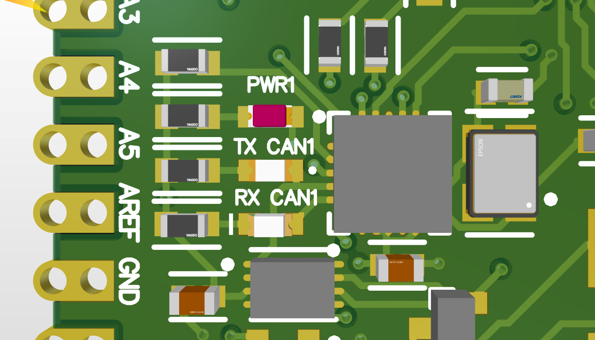

# CANduino
## Short description
CANduino is a Arduino Micro-like board capable of communicating via the CAN 2.0 bus. It is based on ATmega32u4 microcontroller.

[ATmega32u4-documentation](https://ww1.microchip.com/downloads/en/devicedoc/atmel-7766-8-bit-avr-atmega16u4-32u4_datasheet.pdf)

## Schematic
The full schematic is available at [Images/schematic.pdf](Images/schematic.pdf)

## Pcb layout
Board dimensions: 43mm x 30.5mm  
Height: 0.63mm (board) + 10.29mm (Micro-Fit) = 10,92mm (total)

### 3D view

## LED description
There are 3 LEDs on board:
- ${\color{red}Red}$ - PWR (board is powered)
- ${\color{yellow}Yellow}$ - TX CAN (Transmits CAN data)
- ${\color{green}Green}$ - RX CAN (Receives CAN data)

## Power supply
Board works on 5V.
Can be powered by USB-C port or CAN bus (better not at the same time)

## CAN bus
CANduino is using MCP2515 controller with MCP2544FD transceiver during CAN communication. MCP2515 implements the CAN specification, Version 2.0B.

CAN controller bitrate: 1 Mb/s

[MCP2515-documentation](https://ww1.microchip.com/downloads/aemDocuments/documents/APID/ProductDocuments/DataSheets/MCP2515-Family-Data-Sheet-DS20001801K.pdf)

[MCP2544FD-documentation](https://ww1.microchip.com/downloads/aemDocuments/documents/APID/ProductDocuments/DataSheets/MCP2542FD-MCP2542WFD-4WFD-Data-Sheet-DS20005514C.pdf)

### MicroFit pinout
Pinout is compatible with "Sirius 2 standard".
Check current standard here: [Repository](https://github.com/SKA-Robotics/electronics/blob/main/Manipulator%20Harness/README.md)

#### Pinout used in CANduino

|CAN_L|CAN_V|
|-    |-    |
| GND | +5V |

### 120 Ω resistor 
To terminate bus with a 120 Ω resistor connect two pins between Micro-Fit and USB-C port using jumper. 

## Programming
CANduino can be programmed using USB-C port.
Programming is the same as in Arduino.

### Pins 
Side pins enable to get access to most of ATmega pins.  
For more information about pin mapping read Arduino documentation: [link](https://docs.arduino.cc/retired/hacking/hardware/PinMapping32u4/)
#### Analog pins
Analog pins are marked with letter "A", e.g "A1".
#### Digital pins
Digital pins are marked with numbers, e.g "12".
#### PWM pins
PWM pins are marked with leading ".", e.g ".3".

### CAN module
To communicate via CAN bus you can use the Arduino CAN library. Full documentation:
[Repository](https://github.com/sandeepmistry/arduino-CAN)

Wiring in CANduino is traced as default.

| Microchip MCP2515 | ATmega32u4 (Arduino pin names) |
| :---------------: | :-----: |
| VCC | 5V |
| GND | GND |
| SCK | SCK |
| SO | MISO |
| SI | MOSI |
| CS | 10 |
| INT | 2 |

# Credits
Designed by Selim Mucharski and Jakub Bawej.  
Graphic designer - Tomasz Żebrowski.  
Special thanks for Michał Gołąb and Adam Jeliński for support.