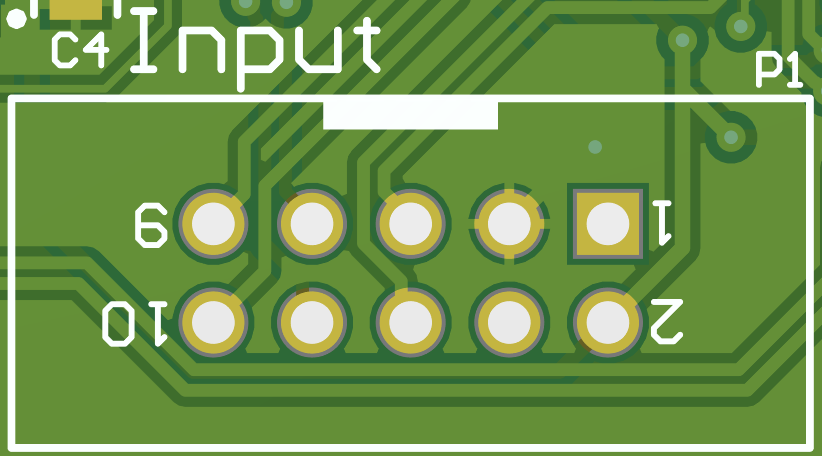
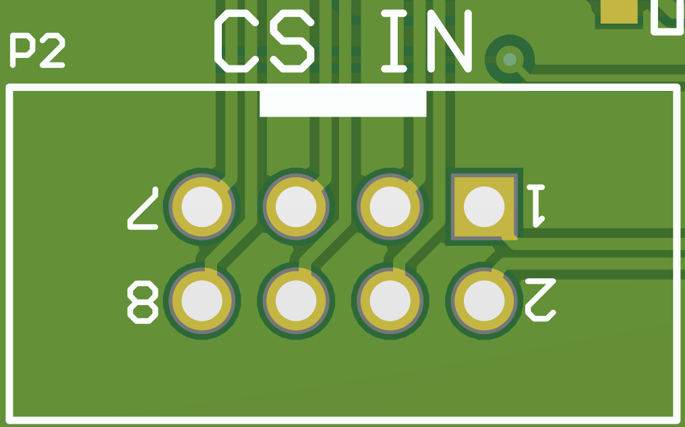
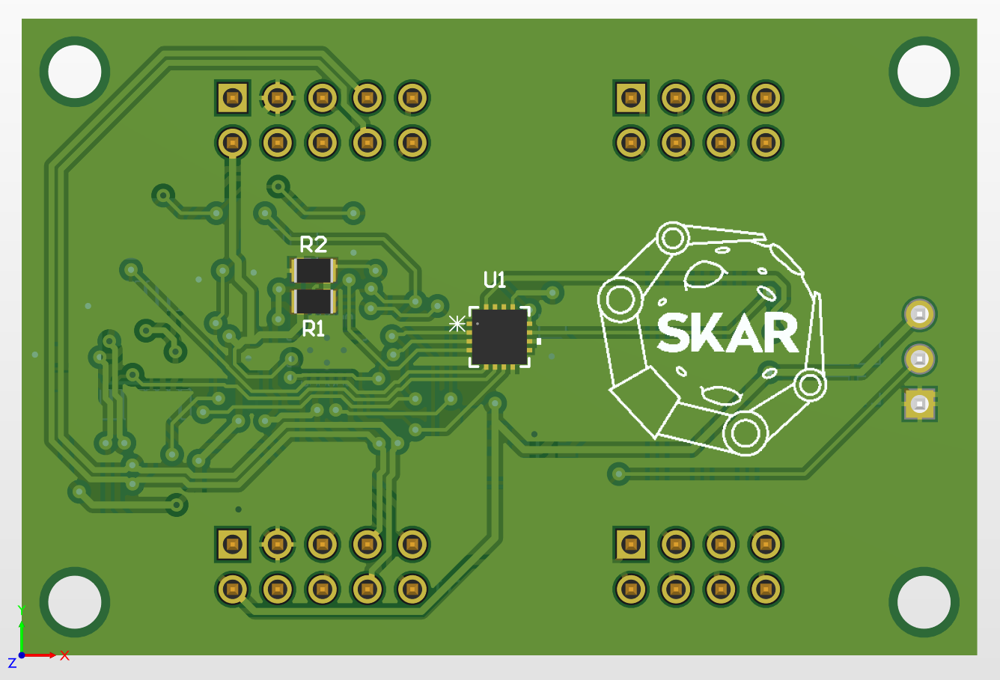
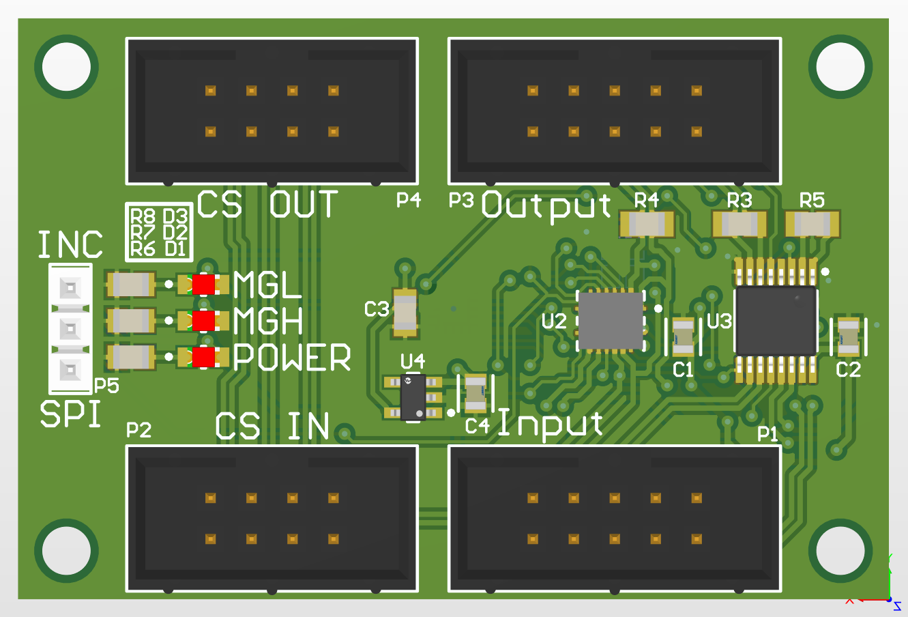
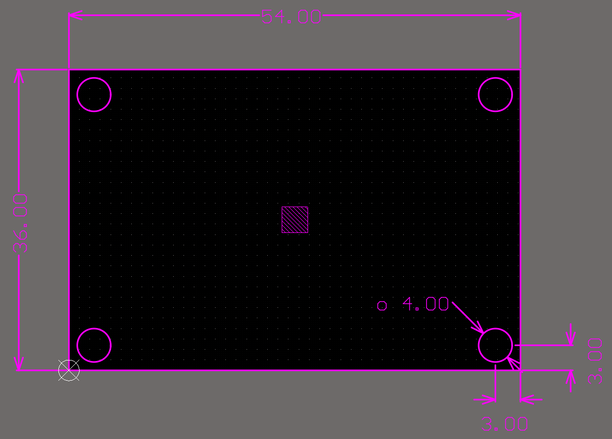

# Encoder
This is a magnetic encoder PCB used for position feedback at every rotating joint

# Overview
This board was designed using the MA732 14-bit magnetic encoder chip to measure absolute angular position for every rotating joint with a help of a diametrically magnetized magnet.

I/O signals are turned into differential signals using SN65C116xE drivers/receivers connected to IDC 8 and IDC10 sockets. Power for MA732 is supplied through a 3.3v LDO voltage regulator.

There are two output modes, ABZ incremental and SPI, that can be switched by using P5 jumper.
Output of both signals is differential, to allow interchangeability with wheel motors and their encoders.

For SPI connection, `CS` pin is routed to a separate connector, to allow a daisy chain connection of up to 4 devices. In this configuration, Input connector of one device should be connected to an output connector of another. This does not work for incremental mode (for obvious reasons).

There are 3 LEDs that indicate current state of the encoder.

Blue -> power present

Red -> magnet too close (MGH)

Yellow -> magnet too far (MGL)

# Pinout

## Input and output

Ground is differentiated with a square pad.
Looking from the top of the connector the pinout for incremental mode is as follows:

|Z_N|B_N|A_N|GND|NC|
|---|---|---|---|--|
|Z_P|B_P|A_P|NC|+5V|

For SPI mode pinout is:

|MOSI_N|MISO_N|SCLK_N|GND|NC|
|------|------|------|---|--|
|MOSI_P|MISO_P|SCLK_P|NC|+5V|

## Chip select 

Only pins 1 and 2 are connected to the encoder, while the rest connects to `CS_OUT` connector, shifting to the right.

Pin 1 -> CS_N

pin 2  -> CS_P

# Pictures

# Notes
There were 12 units made in total. All of the work in incremental ABZ mode, however due to manufacturing issues only a few of them work in SPI mode. 
