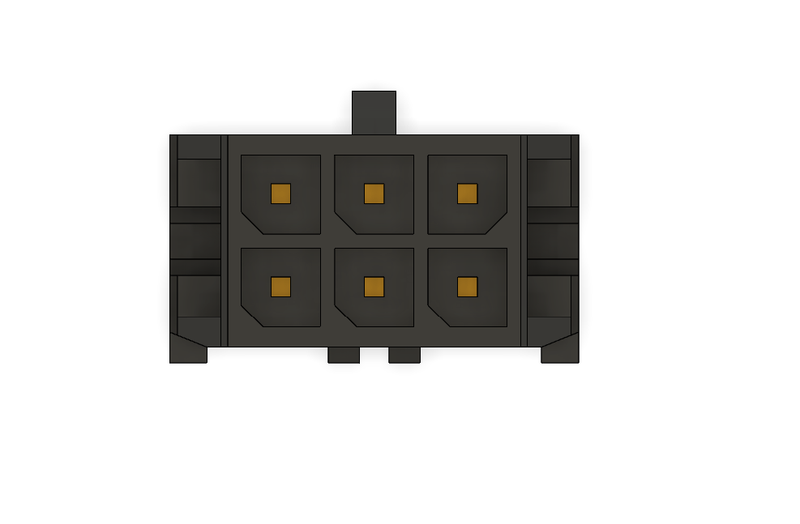
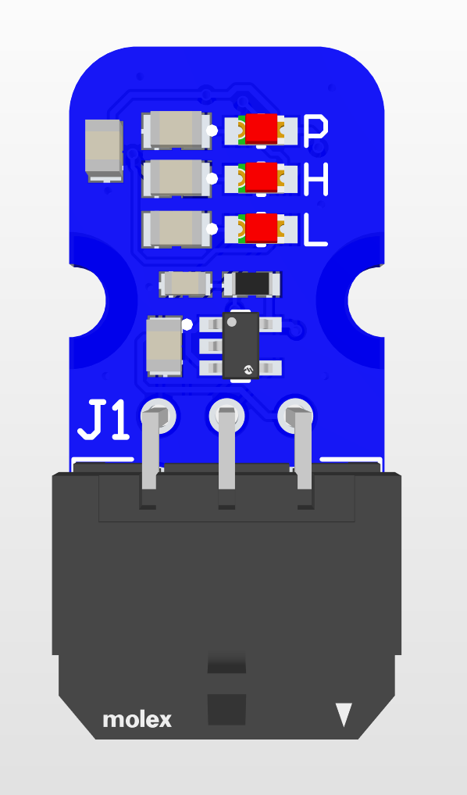
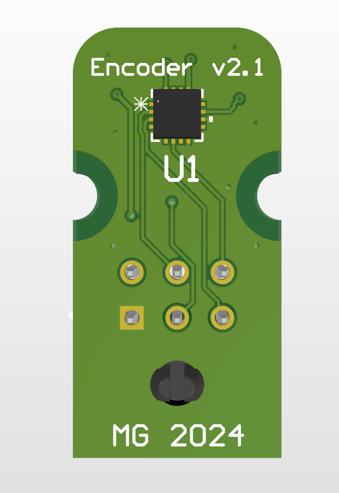
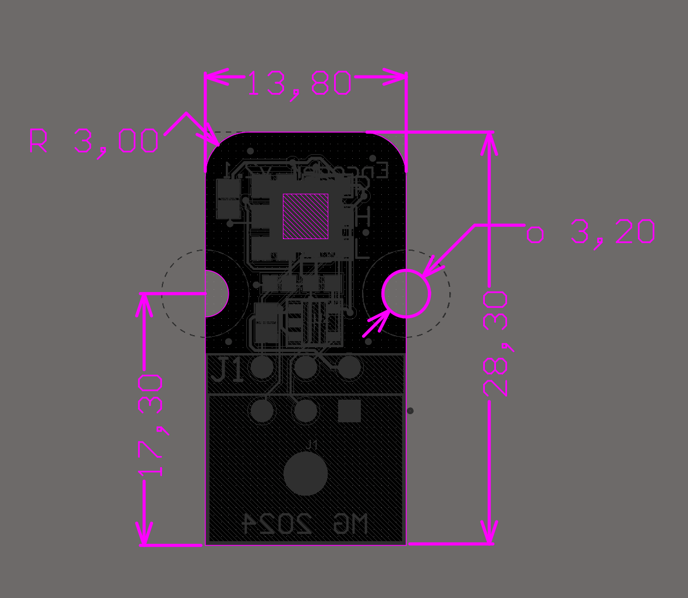

# Encoder 2.1
This is a second edition of a magnetic encoder PCB used for position feedback for wheel motors

# Overview
This board was designed using the MA732 14-bit magnetic encoder chip to measure incremental angular position for wheel motors with a help of a diametrically magnetized magnet.

Output is incremental position using ABZ pulses, connected to 6-pin Molex micro-fit

There's an option for 10k NTC thermistor to measure temperature next to the motor

Blue -> power present

Red -> magnet too close (MGH)

Yellow -> magnet too far (MGL)

# Pinout

| B | A | 5V |
| - | - | -  |
| Z |Rt |GND |

# Pictures

# Notes
5 units (to be) produced.
3V3 power is achieved using internal LDO (300mA max). This will hopefully avoid failure due to voltage spikes.