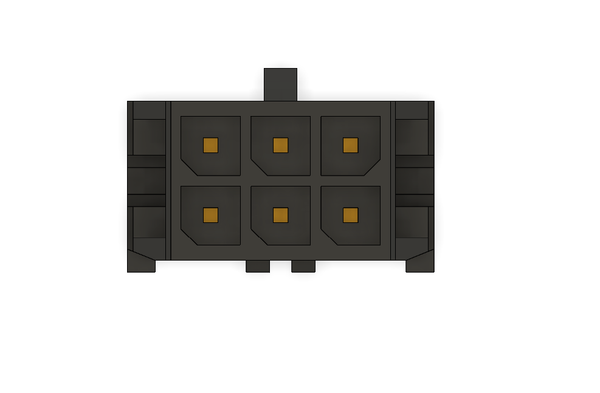
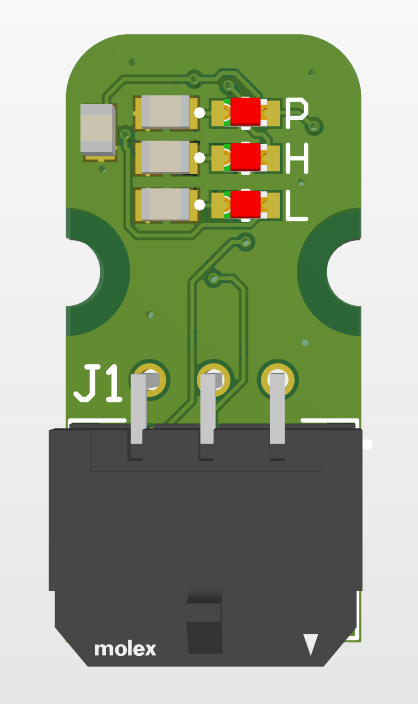
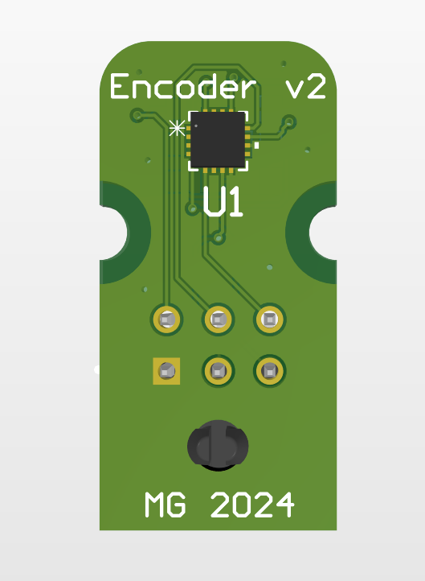
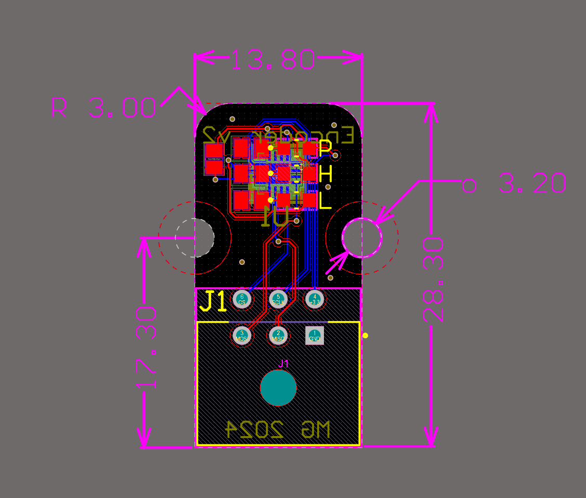

# Encoder
This is a second edition of a magnetic encoder PCB used for position feedback at every rotating joint

# Overview
This board was designed using the MA732 14-bit magnetic encoder chip to measure absolute angular position for every rotating joint with a help of a diametrically magnetized magnet.

Output is absolute position using SPI, connected to 6-pin Molex micro-fit

Blue -> power present

Red -> magnet too close (MGH)

Yellow -> magnet too far (MGL)

# Pinout

| CS |SCLK|3.3V|
|-   |-   |-   |
|MOSI|MISO|GND |

# Pictures

# Notes
15 units produced, some came out faulty.
Possible cause is long wires and direct 3.3V connection, might be beneficial to replace it with 5V and LDO regulator.
