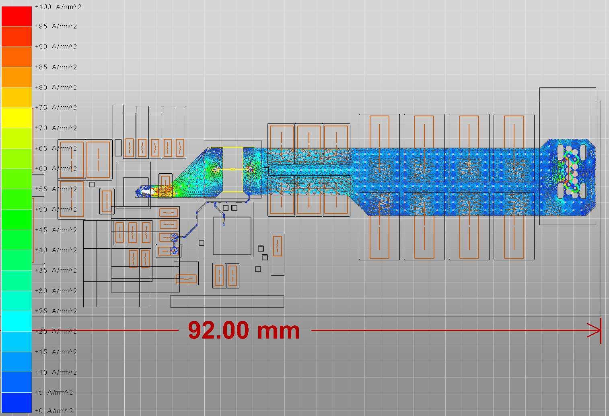
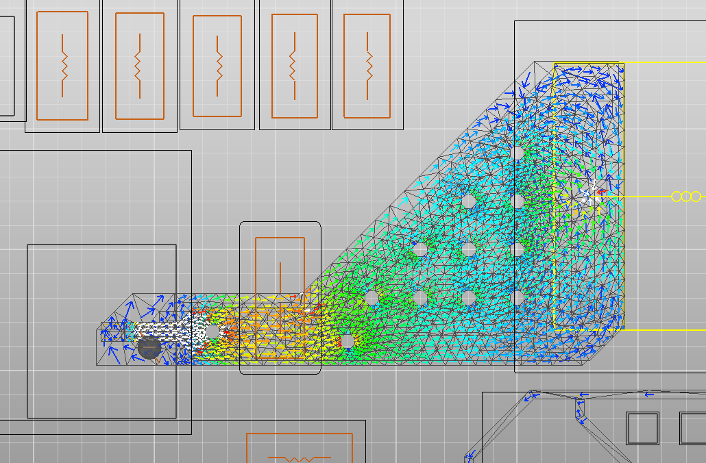

# MPS PD power supply evaluation board
This is an evaluation board for MPS power delivery supply for main computer

# Overview
This board uses *MP5031* as a PD controller and *MP2491* as a step-down converter. Input voltage range is between 4-32V, and top power is 100W.
To achieve 100W PD, an external microcontroller with I2C is needed to set the registers.
The main goal of this board is to evaluate its performance as a power supply replacement, with higher stability and higher working temperature.
Components are placed on one side only, making the other side suitable for radiator placement.

# Pinout
This board uses XT60 as input and USB C as output, with additional 6 pin header for I2C and other controls.

# Pictures

# Settings
To enable operations, following values have to be set in the registers:

0x08: 0xFFFF    -   set max current for PDO 4

0x0B: 0x8500    -   GPIO behaviour    

0x0D: 0x3490    -   GPIO behaviour

0x0E: 0xC898    -   GPIO behaviour

0x0F: 0x6464    -   Max power set to 100W

# Test results

## Simulations
DC IR analysis was conducted to determine current density in this design. The results are shown below

Additional improvements can be made in converter output area by removing restricting via and adding another one to the left of output, to allow for another path for current to flow.
Another area for improvement is directly near USB C output, by tweaking clearance settings.

## Transient response

Device was tested for transient response from 0,5A to 3,5A at 20V output.
Slew rate was 0.5A/us and 1A/us. Scope was located directly at the load.
No real difference in transient response was observed.

## Thermals 

Temperature of the device was measured using IR camera.
The biggest hotspots are the converter IC and coil.
Current draw was ~3,5A.
Possible improvements are using a coil with lower ESR and adding a heat spreader for converter IC.
Proper operation was tested for over 120C
Pictured below is thermal image of the device with and without heatsink.

## Testing in the field

Device was used to power the rovers' PC for over an hour with no heatsing, while the PC was using max power with lots of transient loads.
There were no issues detected.