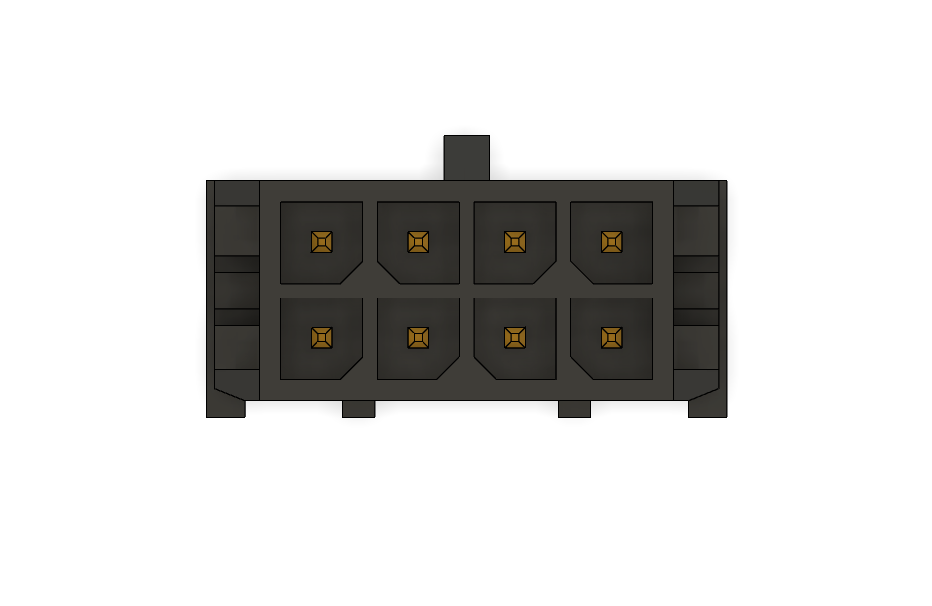
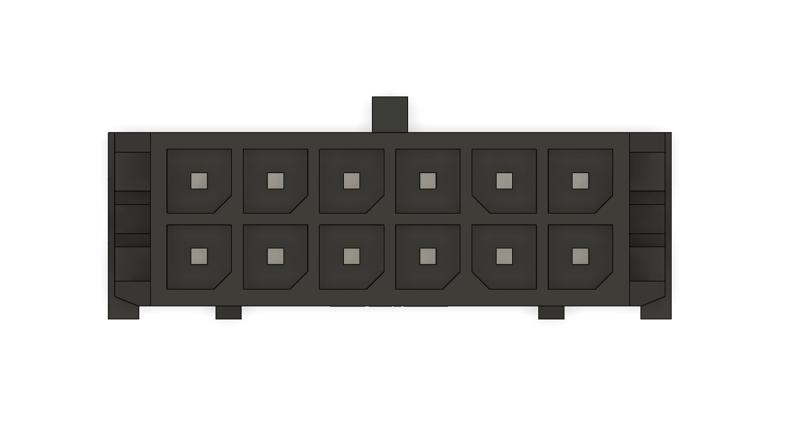

# Manipulator Harness
This is a wiring harness connecting Roboszpon box inside the frame with motors and encoders located on the manipulator, as well as 12V power for the gropper servo

# Overview
Wiring harness is designed with regular Molex Micro-Fit 3.0 connectors in mind.
Cable used is 20AWG or 0.5mm^2 silicone coated copper wire.
Connectors used:
8-pin for rotaiton, 12-pin for motors and servo power, 16-pin for encorers
6-pin for encoders, 2-pin vertical for motors and 2-pin horizontal for servo power

# Part numbers
Male connectors:
- 43020-0200
- 43045-0427
- 43045-0600
- 43020-0800
- 43020-1200
- 43020-1600

Female connectors
- 43025-0200
- 43025-0400
- 43025-0600
- 43025-0800
- 43025-1200
- 43025-1600

Terminals:
- 43030-0001
- 43031-0001

For crimp connectors, a 18 AWG crimp is used, although a 20AWG crimp could be used as well

# Detailed pinout
All pinouts described here are referencing **male** connectors (as in, what you're plugging the harness into)

This is the current motor nomenclature and assigned CAN_ID for reference
- M0 - 0x3 - Rotation
- M1 - 0x2 - Shoulder
- M2 - 0x7 - Elbow
- M3 - 0x6 - Wrist raise
- M4 - 0x5 - Wrist rotation lower
- M5 - 0x4 - Wrist rotation upper

## 4-pin Connector

|CAN_L|CAN_V|
|-    |-    |
| GND | +5V |

## 6-pin Connector

| CS |SCLK|3.3V|
|-   |-   |-   |
|MOSI|MISO|GND |

## 8-pin Connector

|M0+| CS |SCK |3.3V|
|-  |-   |-   |-   |
|M1-|MOSI|MISO|GND |

## 12-pin Connector

This connector is used for the motors ant to power the gripper servo
|M1-|M2-|M3-|M4-|M5-|GND |
|-  |-  |-  |-  |-  |-   |
|M1+|M2+|M3+|M4+|M5+|+12V|

## 16-pin Connector

|3.3V|CS1_a|MISO_a|MOSI_a|SCK_a|CS2_a| CS_c |SCK_c |
|-   |-    |-     |-     |-    |-    |-     |-     |
|GND |CS1_b|MISO_b|MOSI_b|SCK_b|CS2_b|MOSI_c|MISO_c|
 
 CS pins correspond to following motors:
 - CS1_a - M5 (Wrist rotation upper)
 - CS2_a - M4 (Wrist rotation lower)
 - CS1_b - M3 (Wrist raise)
 - CS2_b - M2 (Elbow)
 - CS_c - M1 (Shoulder)
 
# Photos

A complete harness without connecotrs.

Wiring inside Roboszpon box.

# Notes
While mounting harness, make sure to remember about leaving extra length for movement of the joints. Nominal manipulator rotation is 180 degrees in either direction. Other angles are subject to change.
Harness can be secured with velcro stripes or zip-ties. Make sure that there is no interference between moving parts of the frame and your chosen mounting points.

When servicing the harness, try to make the wires equal lengths to balance forces acting on the connector (in case of sudden gripper separation).

While crimping new connectors, remove only as much isolation as is needed. A proper crimp should grab both metal parts of the wire an a bit of the isolation. A proper crimp should resist significant pull force. When inserting a cripmed wire into a plastic housing, push until you hear a satisfying *click*, and ensude the wire is secured by pulling on it.

For further information, refer to manufacturers' guidelines.
