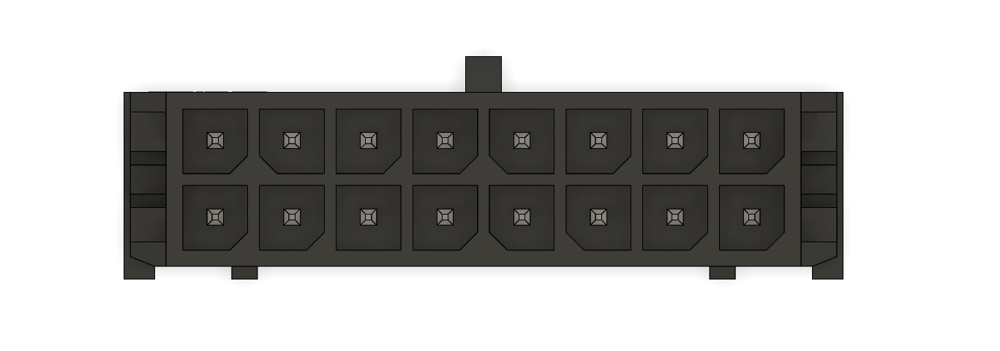

# Manipulator Harness
This is a wiring harness connecting Roboszpon box inside the frame with motors and encoders located on the manipulator, as well as 12V power for the gropper servo

# Overview
Wiring harness is designed with regular Molex Micro-Fit 3.0 connectors in mind.
Cable used is 20AWG or 0.5mm^2 silicone coated copper wire.
Connectors used:
8-pin for zerowyczłonheheTODO, 12-pin for motors and esrvo power, 16-pin for encorers
6-pin for encoders, 2-pin for motors, 2-pin (flat?) for servo power

Part numbers:
TODO

For crimp connectors, a 18 AWG crimp is used, although a 20AWG crimp could be used as well

# Detailed pinout
All pinouts described here are referencing **male** connectors (as in, what you're plugging the harness into)

## 4-pin Connector

|X|X|
|-|-|
|X|X|

## 6-pin Connector

|X|X|X|
|-|-|-|
|X|X|X|

## 8-pin Connector

|X|X|X|X|
|-|-|-|-|
|X|X|X|X|

## 12-pin Connector

|X|X|X|X|X|X|
|-|-|-|-|-|-|
|X|X|X|X|X|X|

## 16-pin Connector

|X|X|X|X|X|X|X|X|
|-|-|-|-|-|-|-|-|
|X|X|X|X|X|X|X|X|

# Photos
TODO

# Notes
While mounting harness, make sure to remember about leaving extra length for movement of the joints. Nominal manipulator rotation is 180 degrees in either direction. Other angles are subject to change.
Harness can be secured with velcro stripes or zip-ties. Make sure that there is no interference between moving parts of the frame and your chosen mounting points.

When servicing the harness, try to make the wires equal lengths to balance forces acting on the connector (in case of sudden gripper separation).

While crimping new connectors, remove only as much isolation as is needed. A proper crimp should grab both metal parts of the wire an a bit of the isolation. A proper crimp should resist significant pull force. When inserting a cripmed wire into a plastic housing, push until you hear a satisfying *click*, and ensude the wire is secured by pulling on it.

For further information, refer to manufacturers' guidelines.
