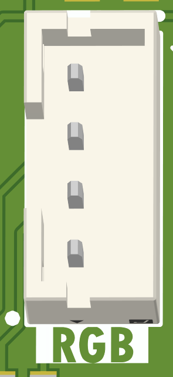
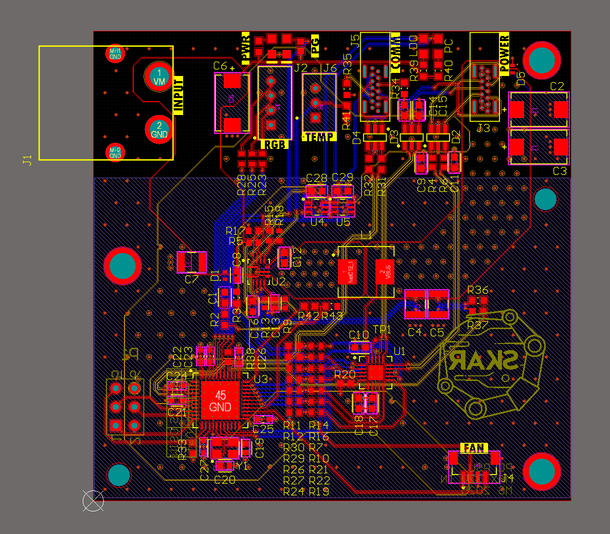
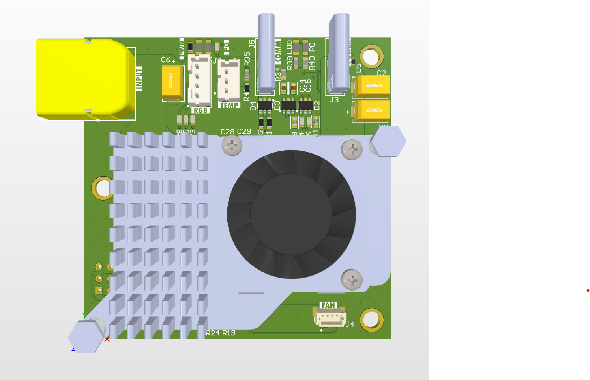
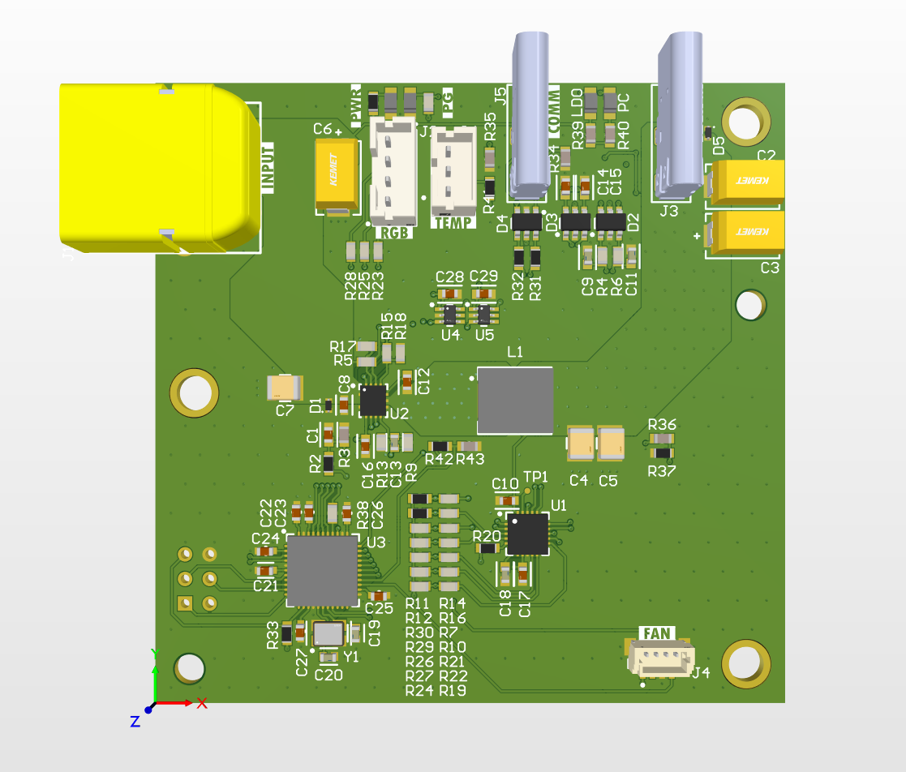
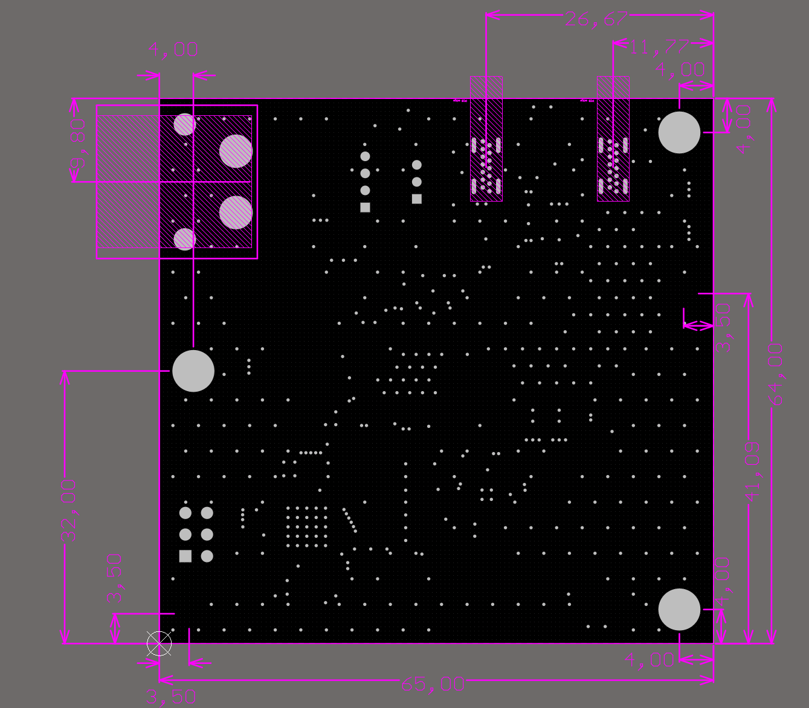

# PC Power supply
This is Power Delivery compatible PC power supply.

# Overview
This board uses *MP5031* as a PD controller and *MP2491* as a step-down converter. Input voltage range is between 4-32V, and top power is 100W.
To cool power path, a Raspberry Pi active cooler is used.
Atmega32u4 is used as a main microcontroller that monitors operation and sets correct register values for *MP5031* to enable 100W PD.
Spare GPIO  from *MP5031* are connected to MCU to allow further monitoring.
Additional functions realised by Atmega32u4 are: Fan control and speed monitoring, RGB button driving, internal temperature monitoring (NTC), external temperature monitoring (DS18B20) and output voltage sensing.

5V is supplied from either internal LDO or PC USB port. To prevent backdriving, ideal diodes are used in parallel for each source.
Active source is displayed using additional LEDs.
Moreover, *Voltage in* and *Power Good* are also connected to external LEDs.

There are 2 vertical USB ports, one for power and other for PC communication.
Extra filtering is added to avoid ESD damage (designed for 8kV/15kV IEC Contact/Air Discharge).

# Pinout
## RGB

LED1

LED2

LED3

+5V

## TEMP

GND

DQ

+5V

## FAN

Tach

GND

PWM

+5V

# Pictures

# Notes
2 devices (to be) made, one as a spare. Source code can be found here (TBD)
