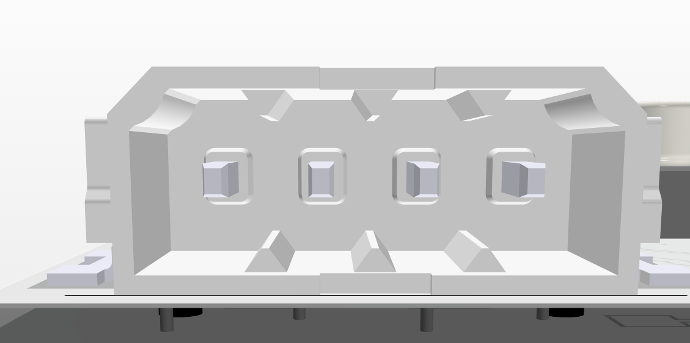
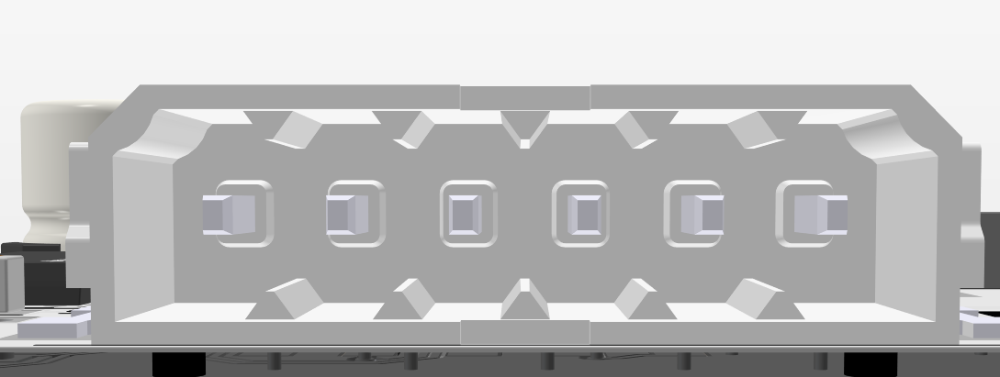
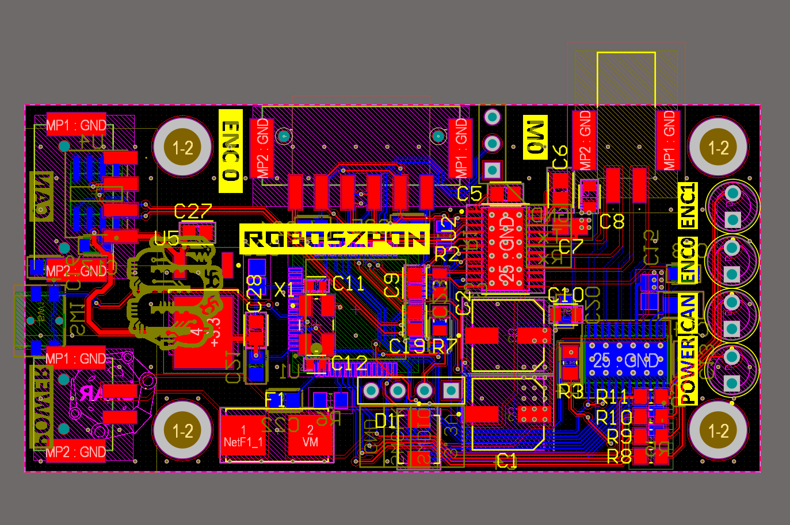
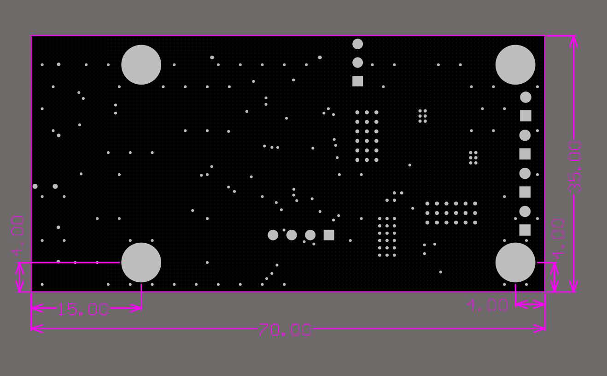

# Roboszpon DC motor driver
This is a custom DC motor driver made to replace previous solution

# Overview

This board uses *STM32F103* as a main MCU and dual *DRV8873* to drive DC motors with up to 6.5A continous current.
Additional connectors for SPI encoders allow for closed loop control.
CAN is used for communication with other devices.
There is additional unused UART header for debugging.
Motor drivers feature a current monitoring output, connected to internal ADC of STM32 MCU.
3.3V for STM32 is provided by onboard LDO connected to 5V from CAN connector.
4 LEDs are added as a current device state indicator.
These are mounted sideways, to allow for them to stick out of the enclosure.
Input is protected by a 10A fuse and TVS diode.
# Pinout
This board uses all PTSM connectors, to be used inside a box enclosure.
## CAN

GND, CANL, CANH, +5V

## Encoder

GND, +3.3V, MISO, MOSI, SCK, CS

# Pictures

# Notes

A total of 10 units were made